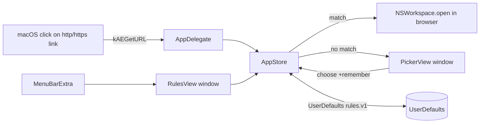

# SDS

## 1. Intro
- **Purpose:** Describe the implementation of Smart Links Opener — a macOS default-browser routing agent.
- **Rel to SRS:** Realizes [REF:fr:default-browser], [REF:fr:route], [REF:fr:picker], [REF:fr:rules-mgmt], [REF:fr:browser-visibility], [REF:fr:background-agent], [REF:fr:login-item], [REF:fr:i18n], [REF:fr:persist], [REF:fr:dist].

## 2. Arch
- **Diagram:**

- **Subsystems:** Agent shell (App/AppDelegate) · Domain state (AppStore) · Views (Picker/Rules) · Models · Resources (Info.plist, entitlements, *.lproj) · Build (build.sh).

## 3. Components

### 3.1 Agent shell — `App.swift` [ANC:sds:agent-shell]
- **Purpose:** `@main SmartLinksOpenerApp` exposes only `MenuBarExtra` (Rules…, default-browser control, Launch at login, Quit). `AppDelegate` (`@MainActor`) sets `.accessory` activation policy, registers the `kAEGetURL` Apple Event handler, owns the on-demand rules window, and presents the picker as a borderless `PickerPanel` (`NSPanel` overriding `canBecomeKey`) anchored just below-right of the cursor (`positionNearCursor`, clamped to the active screen). Realizes [REF:fr:background-agent], [REF:fr:default-browser], [REF:fr:picker].
- **Interfaces:** `handleGetURL(_:withReplyEvent:)` → `AppStore.handleIncoming`; `showRules()` / `showPicker()` / `closePicker()` wired to `AppStore` callbacks; `PickerPanel`, `positionNearCursor(_:)`.
- **Deps:** AppKit, SwiftUI, AppStore.

### 3.2 Domain state — `AppStore.swift` [ANC:sds:store]
- **Purpose:** `@MainActor ObservableObject` singleton. Real-browser enumeration (apps handling both `http` and `https`, via `NSWorkspace`), rule CRUD + persistence, longest-suffix matching, opening URLs in a browser, per-browser usage tracking (`usage.v1`) feeding frequency order, picker-visibility (hidden set under `hiddenBrowsers.v1`), a FIFO queue of pending links, default-browser handoff (`setDefaultApplication(at:toOpenURLsWithScheme:)`), login item (`SMAppService`). Realizes [REF:fr:route], [REF:fr:persist], [REF:fr:login-item], [REF:fr:default-browser], [REF:fr:picker], [REF:fr:browser-visibility].
- **Interfaces:** `handleIncoming(_:)`, `choose(_:for:remember:)`, `cancelPending()`, `matchingBrowser(for:)`, `addRule/deleteRule/updateRuleBrowser`, `refreshBrowsers()`, `setAsDefaultBrowser()`, `isDefaultBrowser()`, `launchAtLogin`; picker-visibility `pickerBrowsers`, `canHideBrowser(_:)`, `setBrowserHidden(_:_:)`, published `hiddenBrowserIDs`; published `pendingURL`/`pendingCount`/`usageCounts`. Private: `advanceQueue()`, `recordUse(_:)`, `handlerBundleIDs(forScheme:)`, `loadHidden()`.
- **Deps:** AppKit, ServiceManagement, Foundation, Models, BrowserRanking.

### 3.3 Picker view — `PickerView.swift` [ANC:sds:picker]
- **Purpose:** Compact, keyboard-first SwiftUI glass panel (320pt wide, `.regularMaterial`, 16pt corners) for an unmatched URL: a mode header (label + second-level domain, where the label flips between "Open & remember" and the orange "Open once — no rule created"), a scrolling **vertical list** of browsers (only non-hidden, via `store.pickerBrowsers`; most-used first; per-row icon tile + name + selected `↩` + 1–9/`0` key badge; the selected row fills with the mode accent — blue normally, orange under ⇧), a `.topTrailing` ✕ close button, and a footer with the ⇧-Shift hint + "+N" queue badge. The default action is open & remember (`remember: !shiftHeld`); ⇧ Shift held → open-once preview (orange accent, no rule). Keystrokes captured by a `KeyCatcher` (`NSViewRepresentable`) that maps ↑/↓ (wrapping), Return, Esc, 1–9 and `0`→10th to `KeyCommand`, plus `flagsChanged` → `.shift(Bool)` for live ⇧ feedback (needed because SwiftUI `onKeyPress` is macOS 14+). Fixed semantic accent colors (`NSColor.systemBlue`/`systemOrange`) signal the mode rather than the user accent. Realizes [REF:fr:picker], [REF:fr:browser-visibility].
- **Interfaces:** `PickerView(url:)`; `enum KeyCommand`; `struct KeyCatcher`; calls `store.choose / store.cancelPending`.
- **Deps:** SwiftUI, AppKit, AppStore.

### 3.4 Rules view — `RulesView.swift` [ANC:sds:rules]
- **Purpose:** SwiftUI management window, two-pane (Claude Design "Variant 2"). Left sidebar (236pt): brand header, browser availability toggles (hiding the last visible one blocked), launch-at-login. Right pane (full height): "Routing rules" title, default-browser banner (amber warning + "Make default" when not default; green confirmation when default), column header (Domain / Open in), scrollable rule list (browser-icon + domain + browser dropdown + delete), and a pinned add-rule row (domain field + dropdown + Add). Rule/add dropdowns offer only enabled (non-hidden) browsers; a rule already pointing at a hidden/uninstalled browser keeps showing its target. No refresh button. Realizes [REF:fr:rules-mgmt], [REF:fr:browser-visibility], [REF:fr:default-browser], [REF:fr:login-item].
- **Interfaces:** `RulesView()`; binds to `store` (`browsers`, `pickerBrowsers`, `hiddenBrowserIDs`, `rules`, `isDefaultBrowser()`, `setAsDefaultBrowser()`, `launchAtLogin`, `icon(for:)`). Window default 720×560, min 560×420 (App.swift).
- **Deps:** SwiftUI, AppStore.

### 3.6 Domain resolver — `Domain.swift` [ANC:sds:domain]
- **Purpose:** Pure, side-effect-free domain logic — reduce a host to its registrable (second-level) domain and test rule matching. Unit-tested in isolation (no AppKit). Realizes [REF:fr:subdomain].
- **Interfaces:** `Domain.registrable(_ host:) -> String`, `Domain.host(_:matchesRule:) -> Bool`, `Domain.normalizeHost(_:)`, `Domain.multiLabelSuffixes`.
- **Deps:** Foundation only.

### 3.5 Models — `Models.swift` [ANC:sds:models]
- **Purpose:** Plain value types. Realizes part of [REF:fr:persist].
- **Interfaces:** `Rule(id, domain, bundleID)` (Codable, Identifiable); `Browser(name, bundleID, appURL)` (Identifiable).
- **Deps:** Foundation.

### 3.7 Browser ranking — `BrowserRanking.swift` [ANC:sds:ranking]
- **Purpose:** Pure, side-effect-free ordering for the picker — most-used browsers first, ties broken by case-insensitive name. Unit-tested in isolation. Realizes part of [REF:fr:picker].
- **Interfaces:** `BrowserRanking.sorted(_ browsers: [Browser], counts: [String: Int]) -> [Browser]`.
- **Deps:** Foundation, Models.

### 3.8 Browser visibility — `BrowserVisibility.swift` [ANC:sds:visibility]
- **Purpose:** Pure, side-effect-free picker-visibility logic — which browsers the picker may show and whether a given browser may still be hidden. The "hidden" set is stored (not "visible") so newly installed browsers appear by default. Unit-tested in isolation. Realizes [REF:fr:browser-visibility].
- **Interfaces:** `BrowserVisibility.visible(_ browsers: [Browser], hidden: Set<String>) -> [Browser]` (order-preserving filter); `BrowserVisibility.canHide(_ id:, hidden:, all:) -> Bool` (false unless ≥1 browser would remain visible — guards an empty picker).
- **Deps:** Foundation, Models.

### 3.9 Picker keys — `PickerKeys.swift` [ANC:sds:picker-keys]
- **Purpose:** Pure, side-effect-free keyboard logic for the picker — hotkey labels (1–9, "0" for the tenth, none beyond), number-key→row mapping (count-bounded), and wrapping ↑/↓ navigation. Extracted from `PickerView` so it is unit-testable without a running view. Realizes part of [REF:fr:picker].
- **Interfaces:** `PickerKeys.hotkey(index:) -> String?`; `PickerKeys.selection(forKey:count:) -> Int?`; `PickerKeys.move(_ current:, by:, count:) -> Int`.
- **Deps:** Foundation.

## 4. Data
- **Entities:**
  - `Rule`: `id: UUID`, `domain: String` (normalized, no `www.`), `bundleID: String`.
  - `Browser`: `name`, `bundleID`, `appURL` (runtime-only, from LaunchServices).
- **ERD:** Rule *→1* Browser (by `bundleID`; browser may be absent if uninstalled → shown with ⚠️).
  - `usageCounts`: `[bundleID: Int]` open counts (runtime + persisted), ordering the picker by frequency.
  - `hiddenBrowserIDs`: `Set<String>` of bundle IDs hidden from the picker list (persisted as a JSON array).
- **Migration:** `UserDefaults` keys `rules.v1` (JSON array of `Rule`), `usage.v1` (JSON `[String: Int]` open counts), and `hiddenBrowsers.v1` (JSON `[String]` hidden bundle IDs). Versioned keys allow future migration; AppKit auto-persists window frame.

## 5. Logic
- **Algos:**
  - `Domain.registrable(host)` — normalize (lowercase, strip trailing dot + `www.`); if >2 labels, match the longest known multi-label public suffix and keep one label in front of it, else take the last two labels. Used on save so rules store the second-level domain.
  - `matchingBrowser(for:)` — keep rules where `Domain.host(host, matchesRule: rule.domain)` (exact or any subdomain), sort by descending `domain.count` (longest-domain wins), return first whose browser is installed.
  - `refreshBrowsers()` — keep only apps in the intersection of `http` and `https` URL handlers (filters out non-browsers that merely registered `https`), then order via `BrowserRanking.sorted(_, counts: usageCounts)`.
  - Queue — `handleIncoming` appends the unmatched URL to `pendingURLs` and raises the picker only when the queue was empty; `choose`/`cancelPending` call `advanceQueue()` which pops the head and either shows the next link or closes. `open()` calls `recordUse()` (increment + persist `usage.v1`, re-sort).
  - Picker visibility — `pickerBrowsers` = `BrowserVisibility.visible(browsers, hidden: hiddenBrowserIDs)` re-ranked by frequency; `setBrowserHidden(id, hidden)` mutates+persists `hiddenBrowsers.v1` but early-returns when `!canHideBrowser(id)` (last-visible guard). `browsers` (all real) is left intact, so rule dropdowns can still surface a rule's hidden/uninstalled target.
- **Rules:** Matched link opens via `NSWorkspace.open([url], withApplicationAt:)` (activates target). Unmatched → FIFO-queue (`pendingURLs`), raise borderless picker at cursor; remembering stores `Domain.registrable`. Default-browser change goes through the system consent dialog; status reflected back to UI.

## 6. Non-Functional
- **Scale/Fault/Sec/Logs:** Single user, tiny rule set. Faults surfaced via `statusMessage` (e.g., login-item/default-browser failures). Security: public APIs, Hardened Runtime, no sandbox by design. No logging/telemetry.

## 7. Constraints
- **Simplified/Deferred:** `Domain.multiLabelSuffixes` is a curated subset of the Public Suffix List, not the full PSL — exotic ccTLD suffixes fall back to last-two-labels. Existing stored rules are not retro-migrated to registrable form (only new saves reduce). Tests cover the pure `Domain` logic, not the AppKit-bound store. App icon (`Resources/AppIcon.icns`) is a generated placeholder — replace with final art before release. No iCloud/sync of rules. Apple-event handling is the sole URL ingress (no SwiftUI `onOpenURL`).
- **Distribution:** two build configs. `prod` = Developer ID + Hardened Runtime, no sandbox (`Resources/SmartLinksOpener.entitlements`). `appstore` = App Sandbox (`Resources/SmartLinksOpener.appstore.entitlements`) for the paid Mac App Store build; rules then live in the app's sandbox container. Realizes [REF:fr:dist.mas]. MAS upload/pricing is a manual maintainer step (see task `open-source-and-appstore`).
