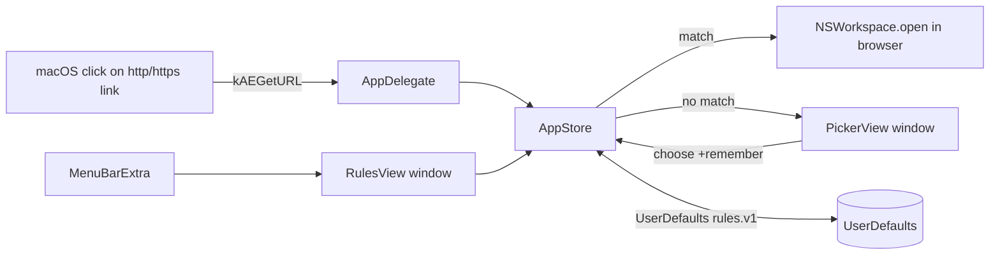

# SDS

## 1. Intro
- **Purpose:** Describe the implementation of Smart Links Opener — a macOS default-browser routing agent.
- **Rel to SRS:** Realizes [REF:fr:default-browser], [REF:fr:route], [REF:fr:picker], [REF:fr:rules-mgmt], [REF:fr:background-agent], [REF:fr:login-item], [REF:fr:i18n], [REF:fr:persist], [REF:fr:dist].

## 2. Arch
- **Diagram:**

- **Subsystems:** Agent shell (App/AppDelegate) · Domain state (AppStore) · Views (Picker/Rules) · Models · Resources (Info.plist, entitlements, *.lproj) · Build (build.sh).

## 3. Components

### 3.1 Agent shell — `App.swift` [ANC:sds:agent-shell]
- **Purpose:** `@main SmartLinksOpenerApp` exposes only `MenuBarExtra` (Rules…, default-browser control, Launch at login, Quit). `AppDelegate` (`@MainActor`) sets `.accessory` activation policy, registers the `kAEGetURL` Apple Event handler, and owns on-demand AppKit windows (rules, floating picker) via `NSHostingController`. Realizes [REF:fr:background-agent], [REF:fr:default-browser].
- **Interfaces:** `handleGetURL(_:withReplyEvent:)` → `AppStore.handleIncoming`; `showRules()` / `showPicker()` / `closePicker()` wired to `AppStore` callbacks.
- **Deps:** AppKit, SwiftUI, AppStore.

### 3.2 Domain state — `AppStore.swift` [ANC:sds:store]
- **Purpose:** `@MainActor ObservableObject` singleton. Browser enumeration (LaunchServices via `NSWorkspace`), rule CRUD + persistence, longest-suffix matching, opening URLs in a browser, default-browser handoff (`setDefaultApplication(at:toOpenURLsWithScheme:)`), login item (`SMAppService`). Realizes [REF:fr:route], [REF:fr:persist], [REF:fr:login-item], [REF:fr:default-browser].
- **Interfaces:** `handleIncoming(_:)`, `choose(_:for:remember:)`, `cancelPending()`, `matchingBrowser(for:)`, `addRule/deleteRule/updateRuleBrowser`, `setAsDefaultBrowser()`, `isDefaultBrowser()`, `launchAtLogin`.
- **Deps:** AppKit, ServiceManagement, Foundation, Models.

### 3.3 Picker view — `PickerView.swift` [ANC:sds:picker]
- **Purpose:** SwiftUI view to choose a browser for an unmatched URL, with a "remember choice for <domain>" toggle. Realizes [REF:fr:picker].
- **Interfaces:** `PickerView(url:)`; calls `store.choose / store.cancelPending`.
- **Deps:** SwiftUI, AppStore.

### 3.4 Rules view — `RulesView.swift` [ANC:sds:rules]
- **Purpose:** SwiftUI management window: default-browser status/button, rule list (domain→browser picker, delete), add-rule row, refresh browsers, launch-at-login. Realizes [REF:fr:rules-mgmt].
- **Interfaces:** `RulesView()`; binds to `store`.
- **Deps:** SwiftUI, AppStore.

### 3.6 Domain resolver — `Domain.swift` [ANC:sds:domain]
- **Purpose:** Pure, side-effect-free domain logic — reduce a host to its registrable (second-level) domain and test rule matching. Unit-tested in isolation (no AppKit). Realizes [REF:fr:subdomain].
- **Interfaces:** `Domain.registrable(_ host:) -> String`, `Domain.host(_:matchesRule:) -> Bool`, `Domain.normalizeHost(_:)`, `Domain.multiLabelSuffixes`.
- **Deps:** Foundation only.

### 3.5 Models — `Models.swift` [ANC:sds:models]
- **Purpose:** Plain value types. Realizes part of [REF:fr:persist].
- **Interfaces:** `Rule(id, domain, bundleID)` (Codable, Identifiable); `Browser(name, bundleID, appURL)` (Identifiable).
- **Deps:** Foundation.

## 4. Data
- **Entities:**
  - `Rule`: `id: UUID`, `domain: String` (normalized, no `www.`), `bundleID: String`.
  - `Browser`: `name`, `bundleID`, `appURL` (runtime-only, from LaunchServices).
- **ERD:** Rule *→1* Browser (by `bundleID`; browser may be absent if uninstalled → shown with ⚠️).
- **Migration:** `UserDefaults` key `rules.v1` (JSON array of `Rule`). Versioned key allows future migration; AppKit auto-persists window frame.

## 5. Logic
- **Algos:**
  - `Domain.registrable(host)` — normalize (lowercase, strip trailing dot + `www.`); if >2 labels, match the longest known multi-label public suffix and keep one label in front of it, else take the last two labels. Used on save so rules store the second-level domain.
  - `matchingBrowser(for:)` — keep rules where `Domain.host(host, matchesRule: rule.domain)` (exact or any subdomain), sort by descending `domain.count` (longest-domain wins), return first whose browser is installed.
- **Rules:** Matched link opens via `NSWorkspace.open([url], withApplicationAt:)` (activates target). Unmatched → set `pendingURL`, raise picker; remembering stores `Domain.registrable`. Default-browser change goes through the system consent dialog; status reflected back to UI.

## 6. Non-Functional
- **Scale/Fault/Sec/Logs:** Single user, tiny rule set. Faults surfaced via `statusMessage` (e.g., login-item/default-browser failures). Security: public APIs, Hardened Runtime, no sandbox by design. No logging/telemetry.

## 7. Constraints
- **Simplified/Deferred:** `Domain.multiLabelSuffixes` is a curated subset of the Public Suffix List, not the full PSL — exotic ccTLD suffixes fall back to last-two-labels. Existing stored rules are not retro-migrated to registrable form (only new saves reduce). Tests cover the pure `Domain` logic, not the AppKit-bound store. App icon (`Resources/AppIcon.icns`) is a generated placeholder — replace with final art before release. No iCloud/sync of rules. Apple-event handling is the sole URL ingress (no SwiftUI `onOpenURL`).
- **Distribution:** two build configs. `prod` = Developer ID + Hardened Runtime, no sandbox (`Resources/SmartLinksOpener.entitlements`). `appstore` = App Sandbox (`Resources/SmartLinksOpener.appstore.entitlements`) for the paid Mac App Store build; rules then live in the app's sandbox container. Realizes [REF:fr:dist.mas]. MAS upload/pricing is a manual maintainer step (see task `open-source-and-appstore`).
